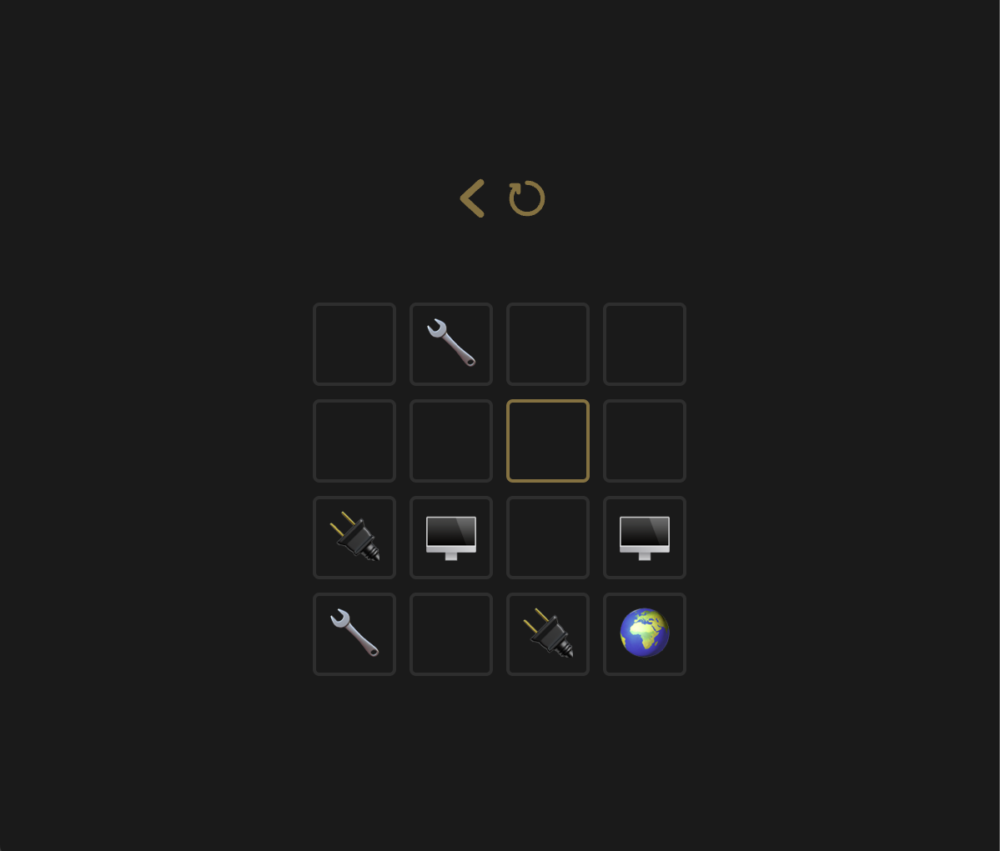
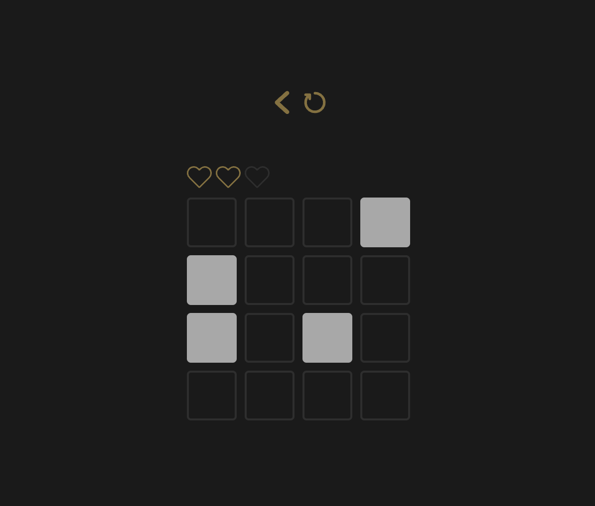
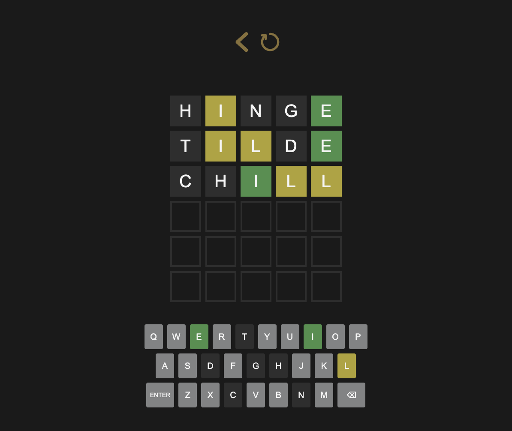

# 🎮 Simple Games App

A minimal React + TypeScript app featuring a collection of simple interactive games.

## 🚀 Available Games

- **Find Pairs**
- **Match Pattern**
- **Wordle** inspired by NYT game
- **Many more to come!**

## 🛠️ Tech Stack

- **React** + **TypeScript**
- **Vite**
- **CSS Modules** for styling
- **ESLint & Prettier** for code consistency

## 📦 Installation

Clone the repository and install dependencies:

```sh
  git clone https://github.com/4bukaj/simple-games.git
  cd simple-games-app
  npm install
```

## 🏃 Running the App

Start the development server:

```sh
  npm run dev
```

Then open [http://localhost:5173](http://localhost:5173) in your browser.

## 📸 Screenshots




